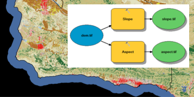
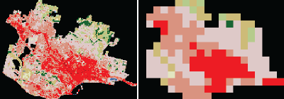
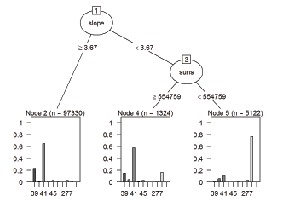
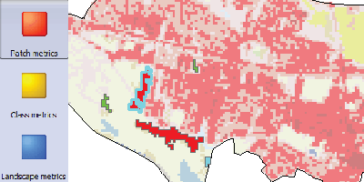
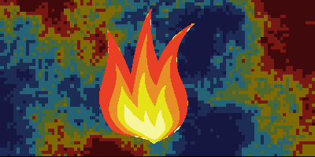
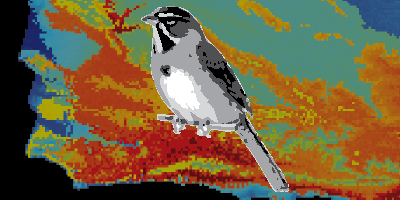
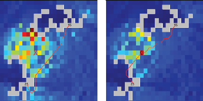
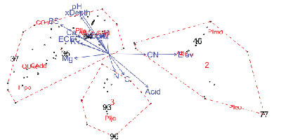
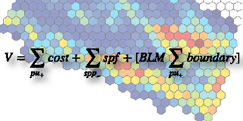

# Landscape Ecology Labs

These Landscape Ecology labs were taught winter quarter 2015 at the [Bren School, UCSB](http://www.bren.ucsb.edu). Originally posted in a private online courseware GauchoSpace. Quickly posting this content for [NEON spatio-temporal data hackathon](http://www.neoninc.org/updates-events/events/hackathon-spatio-temporal-data-lesson-building).

For an overview of the course, see the [syllabus](https://github.com/bbest/landscape-ecology-labs/raw/gh-pages/_syllabus.pdf).

## Labs

Used Rmarkdown to weave instructions with data preparation for various external software and post-process outputs into tables and visualizations.

**Instructions**. Per lab (eg `lab2`), download `lab*.zip` and extract. It will extract to a folder with the same name (eg `lab2_scale.zip` to folder `lab2_scale`). Download the other lab files, especially `lab*.html` and `lab*.Rmd`, into this same extracted folder. You can most easily read the instructions in `lab*.html`. Except for the first lab, you will edit the `lab*.Rmd` in [RStudio](https://www.rstudio.com/) and run code to prepare the data and process outputs.

1. **Introduction**: Touring Landcover using ArcGIS
    
    - [lab1_intro.zip](lab1_intro.zip)
    - [lab1_instructions.docx](lab1_instructions.docx)
    - [lab1_gis-primer.pptx](lab1_gis-primer.pptx)
    - [lab1_introduction.pptx](lab1_introduction.pptx)

1. **Scale**: Quantifying Landcover Changes in Time and Space using R
    
    - [lab2_scale.zip](lab2_scale.zip)
    - [lab3.Rmd](https://github.com/bbest/landscape-ecology-labs/blob/gh-pages/lab3.Rmd)
    - [lab2.html](lab2.html)

1. **Agents**: Physical Controls on Vegetation using ArcGIS
    
    - [lab3_agents.zip](lab3_agents.zip)
    - [lab3.Rmd](https://github.com/bbest/landscape-ecology-labs/blob/gh-pages/lab3.Rmd)
    - [lab3.html](lab3.html)

1. **Metrics**: Measuring edge effects in the landscape using FragStats
    
    - [lab4_metrics.zip](lab4_metrics.zip)
    - [lab4.Rmd](https://github.com/bbest/landscape-ecology-labs/blob/gh-pages/lab4.Rmd)
    - [lab4.html](lab4.html)

1. **Disturbance**: Simulating fire regimes on forests using LANDIS
    
    - [lab5_disturbance.zip](lab5_disturbance.zip)
    - [lab5.Rmd](https://github.com/bbest/landscape-ecology-labs/blob/gh-pages/lab5.Rmd)
    - [lab5.html](lab5.html)

1. **Species**:  Species distribution modeling using Maxent
    
    - [lab6_species.zip](lab6_species.zip)
    - [lab6.Rmd](https://github.com/bbest/landscape-ecology-labs/blob/gh-pages/lab6.Rmd)
    - [lab6.html](lab6.html)

1. **Connectivity**: Connectivity modeling using Circuitscape
    
    - [lab7_connectivity.zip](lab7_connectivity.zip)
    - [lab7.Rmd](https://github.com/bbest/landscape-ecology-labs/blob/gh-pages/lab7.Rmd)
    - [lab7.html](lab7.html)

1. **Communities**: Quantifying species diversity using Vegan in R
    
    - [lab8_communities.zip](lab8_communities.zip)
    - [lab8.Rmd](https://github.com/bbest/landscape-ecology-labs/blob/gh-pages/lab8.Rmd)
    - [lab8.html](lab8.html)

1. **Planning**: Conservation planning using Marxan
    
    - [lab9_planning.zip](lab9_planning.zip)
    - [lab9.Rmd](https://github.com/bbest/landscape-ecology-labs/blob/gh-pages/lab9.Rmd)
    - [lab9.html](lab9.html)

<!-- pandoc README.md -f markdown_github -o index.html -->
